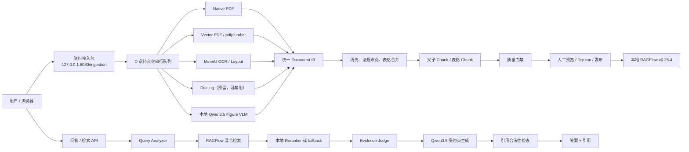

# Internal RAG 项目完整工作总结与 Agent 交接说明

> 最后核对日期：2026-07-31  
> 项目根目录：`D:\internal-rag`  
> 代码目录：`D:\internal-rag\source\internal-rag`  
> 当前运行环境：Windows 宿主机 + Docker Desktop Hyper-V，**不是 WSL 应用部署**  
> 主要入口：`http://127.0.0.1:8080/ingestion`

---

## 1. 给接手 Agent 的最短摘要

这是一个面向企业内网技术资料的本地 RAG 系统，目前由两部分组成：

1. **Internal RAG Gateway**
   - FastAPI 服务；
   - 对接本地 RAGFlow、本地模型和 Reranker；
   - 已实现基础检索、证据判断、受约束生成、引用检查；
   - 提供检索调试和问答 API。

2. **资料接入台**
   - 用户只上传 PDF，不再选择 RAGFlow 的 `Manual`、`Laws`、`Table` 等解析器；
   - 系统自动判断每一页应走原生文本、版面分析、OCR、表格解析、图片理解还是人工复核；
   - 生成统一 Document IR、法规条款 Chunk、结构化表格、质量门禁和 RAGFlow 发布计划；
   - 提供批量上传、文件夹上传、解析进度、页面级诊断、批量发布和本地任务删除。

当前最成熟的部分是：

- Windows/D 盘本地部署；
- RAGFlow、Ollama、MinerU、Gateway 的启停与状态检查；
- PDF 自动接入；
- 法规条号识别与硬边界 Chunk；
- 向量 PDF 表格识别、同页多表拆分、跨页表格合并；
- 页面级解析检查；
- RAGFlow 幂等发布和发布进度。

当前仍需继续投入的部分是：

- 扫描件、水印和极差 PDF 的稳定 OCR；
- 公式的结构化识别；
- 图片/曲线图的可靠语义提取；
- 更通用的跨页复杂表格恢复；
- 独立 Claim 验证模型的完整第五阶段；
- 文档/版本/权限后台和评测系统；
- Reranker 当前未启动。

**接手时不要把当前系统理解成“已经完成的企业知识库成品”。它是一个已经能运行和测试、但仍处于解析质量迭代阶段的工程。**

---

## 2. 原始目标与核心约束

### 2.1 项目目标

构建一个完全可在企业内网运行的技术资料 RAG 问答系统，重点解决：

- 技术手册、法规、标准、测试报告、表格、扫描件等复杂资料接入；
- 关键词/BM25 + Dense 向量 + Reranker 混合检索；
- 数值、单位、协议字段、条款号和代码符号的精确检索；
- 基于证据回答；
- 无证据拒答；
- 部分证据只做部分回答；
- 引用来源可追溯；
- 后续支持文档版本、有效状态和 ACL。

### 2.2 不可随意改变的工程决策

1. 所有可控程序、模型、缓存、日志和数据尽量放在：

   ```text
   D:\internal-rag
   ```

2. 运行环境是 Windows：

   - Gateway：Windows Python；
   - MinerU：Windows Python；
   - Ollama：Windows 原生程序；
   - Reranker：Windows 原生 llama.cpp；
   - RAGFlow：Windows Docker Desktop 的 Hyper-V Linux 容器。

3. 不把本项目应用代码部署到 WSL。

4. 不调用公网云模型 API。

5. 完成离线镜像和模型准备后，系统应能在无公网环境下运行。

6. 当前设备显存约 8 GB，解析任务默认串行：

   ```text
   INGESTION_WORKER_CONCURRENCY=1
   MINERU_API_MAX_CONCURRENT_REQUESTS=1
   OLLAMA_MAX_LOADED_MODELS=1
   OLLAMA_NUM_PARALLEL=1
   ```

7. 不建议同时让 RAGFlow DeepDoc、MinerU 和 Qwen3.5-9B 执行重负载任务。

8. 用户上传时不需要选择解析方法，解析路由必须由预处理服务自动决定。

9. 质量门禁失败的资料不能直接发布到 RAGFlow。

10. 删除接入台中的本地任务，不得联动删除 RAGFlow 中已经发布的知识。

---

## 3. 当前服务状态快照

2026-07-31 最后一次核对：

| 服务 | 状态 | 地址 | 备注 |
|---|---|---|---|
| Gateway | Ready | `http://127.0.0.1:8080` | 资料接入台和 API |
| MinerU | Ready | `http://127.0.0.1:8886` | 3.4.4，串行 |
| RAGFlow | Ready | API `127.0.0.1:9380`，Web `127.0.0.1:18000` | v0.26.4 |
| Ollama | Ready | `http://127.0.0.1:11434` | 0.32.4 |
| Reranker | Unavailable | `http://127.0.0.1:8003` | 当前未启动，开发配置允许 fallback |
| Docling | Disabled | 默认 `127.0.0.1:5001` | 预留远程适配器 |

本地 Ollama 已有模型：

```text
qwen3.5:9b-q4_K_M                 6.6 GB
qwen3:4b-instruct-2507-q4_K_M     2.5 GB
qwen3-embedding:0.6b              639 MB
```

注意：以上只是快照。接手 Agent 执行任何解析或发布前，应重新运行状态脚本。

---

## 4. 总体架构



---

## 5. D 盘目录布局

```text
D:\internal-rag\
├── source\
│   └── internal-rag\                 # 本项目代码
├── runtime\
│   ├── ragflow-0.26.4\               # RAGFlow 本地源码/部署文件
│   ├── docker-desktop\               # Docker Desktop 及 Hyper-V 数据
│   ├── ollama\                        # ollama.exe
│   ├── llama.cpp-b10141\              # llama-server.exe
│   ├── gateway\                       # Gateway 运行文件和日志
│   └── mineru\                        # MinerU 独立运行环境
├── models\
│   ├── ollama\
│   ├── reranker\
│   └── mineru\
├── data\
│   └── ingestion\
│       ├── originals\                 # SHA-256 内容寻址原件
│       ├── jobs\                      # 可恢复 job.json
│       ├── outputs\                   # Document IR、Chunk、QA、资产
│       └── temporary\                 # 上传临时文件
├── cache\
├── logs\
├── backups\
│   ├── images\                        # 离线 Docker 镜像
│   └── source\                        # 源码归档
├── secrets\
│   └── ragflow.env                    # RAGFlow 本地密钥，不提交 Git
└── temp\
```

### 5.1 单个接入任务产物

```text
D:\internal-rag\data\ingestion\outputs\<job_id>\<document_folder>\
├── baseline.json      # 原始页面基线和初始路由
├── document_ir.json   # 统一文档结构，发布的主要输入
├── cleaned.md         # 清洗后文本
├── chunks.jsonl       # 最终检索 Chunk
├── qa.json            # 质量指标、解析轨迹和门禁
└── assets\            # 表格、页面、图片等预览资产
```

---

## 6. 代码结构与职责

```text
app/
├── main.py
├── api/v1/
│   ├── health.py
│   ├── admin.py
│   ├── retrieval.py
│   ├── chat.py
│   └── ingestion.py
├── core/
│   ├── config.py
│   ├── exceptions.py
│   ├── logging.py
│   └── middleware.py
├── ingestion/
│   ├── jobs.py
│   ├── pipeline.py
│   ├── regulations.py
│   ├── parsers/
│   │   ├── native_pdf.py
│   │   ├── vector_pdf.py
│   │   ├── remote.py
│   │   ├── hybrid_pdf.py
│   │   ├── figure_vision.py
│   │   └── registry.py
│   └── publishers/
│       └── ragflow.py
├── services/
│   ├── access_control.py
│   ├── query_analyzer.py
│   ├── ragflow_client.py
│   ├── retrieval_service.py
│   ├── reranker_client.py
│   ├── evidence_judge.py
│   ├── evidence_extractor.py
│   ├── answer_generator.py
│   ├── citation_service.py
│   ├── citation_validator.py
│   └── model_client.py
├── pipelines/
│   └── rag_pipeline.py
└── web/
    ├── ingestion.html
    └── static/
        ├── ingestion.css
        └── ingestion.js
```

关键文件：

| 文件 | 职责 |
|---|---|
| `app/ingestion/jobs.py` | 上传、队列、任务状态、重试、删除、预览、发布 |
| `app/ingestion/pipeline.py` | 统一 IR、清洗、条款、表格、Chunk、QA |
| `app/ingestion/parsers/hybrid_pdf.py` | 各解析器的调度与结果合并 |
| `app/ingestion/parsers/vector_pdf.py` | 矢量表格、图片、公式页预检和资产 |
| `app/ingestion/parsers/remote.py` | MinerU/Docling 协议适配 |
| `app/ingestion/parsers/figure_vision.py` | 本地 VLM 图表说明 |
| `app/ingestion/regulations.py` | 法规条号、别名、关键词、问题别名 |
| `app/ingestion/publishers/ragflow.py` | RAGFlow 发布计划、上传和幂等写入 |
| `app/services/retrieval_service.py` | 混合召回、过滤、重排、上下文 |
| `app/pipelines/rag_pipeline.py` | 证据判断和受约束生成 |

---

## 7. 从项目开始到现在完成的工作

### 7.1 第一阶段：项目设计

完成了以下设计决策：

- FastAPI Gateway 与 RAGFlow 解耦；
- 所有第三方接口通过适配层调用；
- 模型使用 OpenAI 兼容接口或 Ollama；
- 检索采用 BM25/关键词 + Dense + Reranker；
- 引用由后端映射，不允许模型自行编造；
- 设计三道防幻觉闸门：
  1. 检索/证据充分性；
  2. 结构化生成；
  3. Claim 独立验证；
- 预留 ACL、版本过滤、评测和文档管理。

### 7.2 第二阶段：最小可运行 Gateway

已完成：

- FastAPI 应用工厂；
- YAML + 环境变量配置；
- 开发/生产配置分离；
- 统一异常处理；
- JSON 日志；
- Request ID 中间件；
- `/health`；
- `/ready`；
- 服务注册与状态检查；
- RAGFlow 客户端；
- OpenAI 兼容本地模型客户端；
- Docker Compose 骨架；
- pytest、ruff、mypy 配置。

### 7.3 第三阶段：基础检索

已完成：

- 查询标准化和类型判断；
- 原始查询与改写查询并存；
- RAGFlow 检索适配；
- 项目、版本、文档、有效状态过滤；
- 默认强制 `status=effective`；
- 历史版本必须显式开启；
- Reranker 客户端；
- 开发环境可在 Reranker 不可用时 fallback；
- 父 Chunk 和相邻 Chunk 补充；
- 引用 C1/C2/C3 映射；
- `/api/v1/retrieval/search`；
- `/api/v1/retrieval/debug`；
- 返回 hybrid/vector/keyword/rerank 分数和过滤原因。

### 7.4 第四阶段：受约束生成

已完成：

- Evidence Judge；
- 需求拆分与证据覆盖判断；
- `ANSWERABLE`、`PARTIALLY_ANSWERABLE`、`UNANSWERABLE`、`CONFLICTED`；
- Evidence Extractor；
- Qwen3.5 严格 JSON Schema 输出；
- Pydantic 校验；
- 最多一次 JSON 修复；
- 引用编号合法性检查；
- 数值与引用的语义检查；
- 部分回答不能被模型升级为完整回答；
- 无证据和冲突时安全拒答；
- `/api/v1/chat/completions`。

当前没有完整实现第五阶段的独立 Claim Verifier。代码中只保留了相关辅助入口，
不要把当前 `citation_validator` 当成已经完成的独立 4B Claim 验证模型。

### 7.5 Windows/D 盘本地部署

已完成：

- Docker Desktop D 盘安装脚本；
- Docker Desktop Hyper-V 数据迁移到 D 盘；
- RAGFlow v0.26.4 本地源码和固定镜像；
- RAGFlow 离线镜像打包和加载脚本；
- RAGFlow MySQL、Redis、MinIO、Elasticsearch 独立端口；
- RAGFlow 密钥自动写入 `D:\internal-rag\secrets\ragflow.env`；
- Gateway Windows 启停脚本；
- MinerU Windows 本地安装和启停；
- Ollama Windows 本地安装路径和模型目录；
- llama.cpp CPU Reranker 启停；
- 所有服务状态脚本。

### 7.6 本地模型配置

模型分工：

| 用途 | 模型 | 运行方式 |
|---|---|---|
| 回答/图片理解 | `qwen3.5:9b-q4_K_M` | Ollama + GPU |
| Embedding | `qwen3-embedding:0.6b` | Ollama |
| 后续 Claim 验证 | `qwen3:4b-instruct-2507-q4_K_M` | Ollama |
| Reranker | `Qwen3-Reranker-0.6B-Q8_0-GGUF` | llama.cpp CPU |

已处理的问题：

- Ollama 不在系统 PATH 时，统一通过
  `D:\internal-rag\runtime\ollama\ollama.exe` 或启停脚本调用；
- RAGFlow 容器访问宿主机 Ollama 使用：

  ```text
  http://host.docker.internal:11434
  ```

- Windows Gateway 访问 Ollama 使用：

  ```text
  http://127.0.0.1:11434
  ```

- `start-ollama.ps1` 固定：

  ```text
  OLLAMA_CONTEXT_LENGTH=8192
  OLLAMA_MAX_LOADED_MODELS=1
  OLLAMA_NUM_PARALLEL=1
  OLLAMA_KEEP_ALIVE=30s
  OLLAMA_NO_CLOUD=1
  ```

- Gateway OpenAI 兼容回答请求带：

  ```json
  {
    "reasoning_effort": "none"
  }
  ```

- Figure VLM 的 Ollama 原生请求带：

  ```json
  {
    "think": false
  }
  ```

这比仅在提示词顶部写 `/no_think` 更可靠。

### 7.7 单入口资料接入台

产品形态从“让用户选 Manual/Laws/Table”改为：

```text
上传文件
  -> 系统自动判断文件和页面类型
  -> 自动选择解析器
  -> 统一清洗与切块
  -> 质量门禁
  -> 人工检查
  -> 发布 RAGFlow
```

已实现：

- 多 PDF 批量上传；
- 文件夹上传；
- SHA-256 内容寻址保存；
- 同一原件复用，不覆盖原件；
- 持久化串行队列；
- Gateway 重启后恢复残留任务；
- 解析进度条；
- RAGFlow 发布进度条；
- 刷新按钮动作和自动轮询；
- “未发送/已发送”分栏；
- 批量勾选与批量发送；
- 删除待发送或已发送的本地任务；
- 页面级问题列表；
- 点击问题页直接用原 PDF 打开并定位，不重新下载；
- 原始文本、清洗文本、内容块、Chunk、表格和图片资产对照；
- 失败重试；
- RAGFlow dry-run；
- 人工确认正式发布。

当前上传入口只接受 PDF。文件夹上传实际上是浏览器递归选择文件夹内的 PDF，
不是后端直接读取任意本地目录。

### 7.8 法规专用清洗

针对“第21.1条1的内容是什么”等精确问题，增加了：

- 中文法规条号；
- 小数条号；
- 多级条号；
- 带字母条号；
- 条/款/项别名；
- 条号规范化 ID；
- 父条款 ID；
- 条款硬边界；
- 法规专用 Chunk 长度；
- 条号关键词；
- 问题别名；
- RAGFlow 发布 tags；
- 检索时的条号精确匹配基础。

示例别名会覆盖类似：

```text
21.1
第21.1条
21.1条
第21.1条第1款
21.1(1)
21.1(a)
```

目录页默认标记为 `toc_excluded`，保留在基线和预览中，但不生成检索 Chunk。

### 7.9 表格、图片和公式解析增强

这是最近投入最多的部分。

#### 表格

已完成：

- pdfplumber 默认表格提取；
- 扩展线框表格检测；
- 防止“多个碎片分数高于一个完整表格”；
- 同一页多个带标题表格保留为独立表格；
- 一个超大网格中嵌套“表1/表2”时自动拆分；
- HTML `rowspan`/`colspan` 展开；
- 空列删除；
- 稀疏数字列修复；
- 重复表头删除；
- 重复行删除；
- 相邻页跨页表格合并；
- 表格 ID；
- `source_page_start/source_page_end`；
- 表格行到物理页码映射；
- 表格按完整行切 Chunk；
- 每个子 Chunk 重复表头；
- RAGFlow 发布时同时提供可检索文本和结构化 HTML；
- 表格结构损坏或 HTML 泄漏时质量门禁阻止发布。

#### 图片/曲线图

已完成：

- 检测图像密集页；
- 保存整页或局部图片资产；
- 页面级对照查看；
- 本地 Qwen3.5 VLM 按 JSON Schema 生成图题、类型、坐标轴、曲线和不确定项；
- VLM 结果明确标记“发布前需复核”；
- VLM 失败不会直接把猜测内容当成确定事实。

#### 公式

目前只实现：

- 公式页候选检测；
- 页面资产保留；
- 在诊断界面中显示；
- 交由 MinerU/后续公式解析器处理的扩展点。

公式转 LaTeX、上下标、根号和分式的稳定结构化还没有完成。

---

## 8. 自动解析流程

### 8.1 上传与队列

1. 检查扩展名和 PDF 文件签名；
2. 检查最大上传大小；
3. 计算 SHA-256；
4. 原件保存到：

   ```text
   originals\<sha前两位>\<sha>\source.pdf
   ```

5. 生成独立 job；
6. 写入 D 盘 `job.json`；
7. 进入串行队列；
8. 任务处理完成后写入统一产物。

任务状态：

| 状态 | 含义 |
|---|---|
| `queued` | 等待处理 |
| `running` | 正在解析 |
| `completed` | 门禁通过 |
| `warning` | 有结果，但需要抽检 |
| `needs_review` | 存在失败门禁，禁止发布 |
| `failed` | 程序或文件错误 |

### 8.2 页级路由

典型页路由包括：

| 路由 | 含义 |
|---|---|
| `native_text` | 原生文本层可用 |
| `vector_layout` | 需要矢量版面/表格恢复 |
| `remote_ocr` | 交给 MinerU OCR |
| `remote_layout` | 交给远程布局解析 |
| `figure_review` | 图片/曲线图需要 VLM 或人工复核 |
| `formula_review` | 公式页需要专门处理 |
| `toc_excluded` | 目录保留但不进检索 Chunk |
| `low_text_review` | 文本过少，需要复核 |
| `ocr_required` | 原生文本不可用 |

路由不是单纯按字符数判断。当前综合使用：

- 原生字符数量；
- 文本覆盖率；
- PDF 页面对象；
- 线段/矩形数量；
- 图像占比；
- 表格标题和密集数字特征；
- pdfplumber 表格检测结果；
- 是否存在公式特征；
- 是否是目录；
- 是否为扫描页；
- 远程解析可用性；
- 质量门禁。

### 8.3 解析器职责

#### Native PDF

- 提取基础文本；
- 生成页码和原始基线；
- 初步识别目录、低文本页和表格提示。

#### Vector PDF

- 分析线框、矩形、图片和文本位置；
- 恢复矢量表格；
- 保留表格外文本；
- 生成表格/图片资产；
- 检测公式和图表候选页。

#### MinerU

- 处理扫描页；
- OCR；
- 复杂布局；
- 提取 HTML 表格、图片、公式和 bbox；
- 当前固定 `mineru[pipeline]==3.4.4`；
- 使用独立 uv-managed Python 3.12，避免 Anaconda/ONNX DLL 冲突。

#### Docling

- 远程适配已经存在；
- 默认禁用；
- 用于后续和 MinerU 做互补或 fallback。

#### Figure VLM

- 只分析图中明确可见内容；
- 输出严格 JSON；
- `think=false`；
- 描述结果始终要求人工抽检。

### 8.4 统一 IR 和清洗

不同解析器结果不会直接进入 RAGFlow，而是先合并为：

- `PageRecord`；
- `BlockRecord`；
- `ChunkRecord`；
- `AssetRecord`；
- `ParsedDocument`。

统一 IR 保留：

- 物理页码；
- 原始文本；
- 清洗文本；
- 页面路由；
- 页面类型；
- 章节路径；
- 条款 ID；
- 表格 ID；
- 表格标题；
- 表格二维行列；
- 表格页码范围；
- 图片/表格资产；
- bbox；
- 解析器轨迹；
- 质量门禁。

---

## 9. Chunk 设计

### 9.1 普通法规 Chunk

采用父子结构：

- 父级：章节或条款；
- 子级：具体段落、列表、参数说明；
- 条款标题是硬边界；
- 默认不会跨条款拼接；
- 保留章节路径、条款号、页码和父 Chunk ID。

### 9.2 表格 Chunk

表格不会只压平成无结构数字流。

每个表格 Chunk 包含：

- `content_type=table`；
- `table_id`；
- `table_title`；
- `table_rows`；
- `table_html`；
- `page_start/page_end`；
- 可检索的文本表示；
- 重复表头；
- 对应资产 ID。

超长表格只在完整行边界切分，不允许把一行拆成两个 Chunk。

### 9.3 RAGFlow 实际发布内容

发布时构建：

```text
文档/章节/条款/页码前缀
+
清洗后的可检索文本
+
结构化表格 HTML（表格 Chunk）
```

同时写入：

- 条款号；
- 条款别名；
- 问题别名；
- 关键词；
- `content_type:table`；
- `table_id:<id>`；
- 页码范围；
- 文档 SHA-256；
- Chunk 确定性哈希。

因此表格不是仅靠一个 `table` 标签表示，也不是只发送截图。当前同时发送文本和
结构化 HTML；截图/页面资产用于审计和人工核对。

---

## 10. 质量门禁

质量门禁分 `pass`、`warn`、`fail`。

当前主要检查：

- 文本覆盖率；
- 清洗前后字符保留比例；
- Unicode 替换字符；
- 页眉页脚清理；
- 目录页；
- 条款硬边界；
- 表格候选页是否已结构化；
- 表格二维结构是否合法；
- 表格是否泄漏原始 `<table>/<td>` 字符串到普通 Chunk；
- 跨页表格是否存在重复行；
- 图片页是否已经描述；
- VLM 描述是否失败；
- OCR 页面是否仍未解决；
- 远程解析器错误。

发布规则：

| Job 状态 | 是否允许发布 |
|---|---|
| `completed` | 允许 |
| `warning` | 允许，但应先人工复核 |
| `needs_review` | 禁止 |
| `failed` | 禁止 |
| `queued/running` | 禁止 |

---

## 11. RAGFlow 集成

### 11.1 固定版本

```text
RAGFlow v0.26.4
infiniflow/ragflow:v0.26.4
```

### 11.2 端口

```text
RAGFlow API       127.0.0.1:9380
RAGFlow Web       127.0.0.1:18000
MySQL             127.0.0.1:13306
Redis             127.0.0.1:16379
MinIO             127.0.0.1:19000
MinIO Console     127.0.0.1:19001
Elasticsearch     127.0.0.1:1200
```

### 11.3 Dataset ID

资料接入台输入框需要的是 **RAGFlow Dataset ID**，不是知识库显示名称。

例如用户创建知识库“规章1”后，仍需从 RAGFlow/API 获取它的真实 Dataset ID。
不能把“规章1”三个字直接当成 Dataset ID，除非 RAGFlow 实际 ID 恰好如此。

### 11.4 发布步骤

1. 对 `completed/warning` 任务生成 dry-run；
2. 校验目标 Dataset ID；
3. 生成确定性 `plan_sha256`；
4. 上传原 PDF，但不触发 RAGFlow DeepDoc 重新解析；
5. 将外部生成的 Chunk 写入 RAGFlow；
6. 保存 RAGFlow document ID；
7. 逐 Chunk 更新发布进度；
8. 重试时跳过已存在的同内容 Chunk。

### 11.5 幂等和冲突处理

- 相同文件、相同 Dataset、相同 Chunk 计划不会重复写入；
- 发布计划由源文件 SHA、Dataset 和 Chunk 内容生成；
- 已存在同名文档时使用已记录 document ID 继续；
- 如果 RAGFlow 已人工删除对应文档，重试时需要重新创建文档；
- 代码会识别文档名冲突和 API 拒绝，并将任务标记为发布失败。

### 11.6 删除语义

接入台的“删除”只删除：

- 本地 job；
- 本地输出；
- 没有被其他 job 引用的本地原件。

它不会调用 RAGFlow 删除 API，也不会删除已经写入知识库的内容。

处理中、排队中或正在发布的任务不能删除。

---

## 12. 资料接入台当前界面能力

入口：

```text
http://127.0.0.1:8080/ingestion
```

已实现：

- 选择多个 PDF；
- 拖入多个 PDF；
- 选择文件夹；
- 上传进度文字；
- 解析进度条；
- 串行队列数量；
- 自动刷新；
- 手动刷新动画和状态；
- 服务 Ready 状态；
- 未发送/已发送标签页；
- 全选可发送资料；
- 批量发布；
- 批量发布进度；
- 单任务重试；
- 本地删除；
- 生成发布计划；
- 正式发布；
- 发布 Chunk 进度；
- 页面路由汇总；
- 质量门禁列表；
- 问题页直达；
- 原 PDF 内嵌查看；
- 页面、表格、图片、原始文本和清洗结果并排检查；
- Chunk 预览；
- 显示“发送至 RAGFlow 的实际内容”。

PDF 查看器的页码是 PDF **物理页码**。文档印刷页码可能与物理页码不同，
不要混用。

---

## 13. 已验证的真实文档与结果

### 13.1 CCAR-25-R4 运输类飞机适航标准

最终重处理 Job：

```text
fb8e5f4d8dfc4a959fa3e7d0e667e74f
```

结果：

- 260 页；
- 673 个 Chunk；
- 28 个结构化表格；
- 2 个跨页表格；
- 无未解决表格候选页；
- 无无效表格页；
- 无 HTML 泄漏；
- 第258页正确识别表1和表2；
- 表2正确跨页合并至第259页；
- 表2共53行、12列；
- 第260页正确拆分为表3、表4、表5；
- 第258–260页共生成8个完整行表格 Chunk。

任务为 `warning`，不是表格失败。原因：

- 40个图表页需要复核；
- 39页已生成 VLM 描述；
- 第215页一次 VLM JSON 输出不完整。

### 13.2 HB 9131-2012 跨页代码表

回归 Job：

```text
a7f26d6b086644aaaf8bead26b9aa95f
```

结果：

- 5 个结构化表格；
- 2 个跨页表格；
- 删除23个重复行；
- P229、P230、P231、P232、P241 各保留一次；
- Chunk 中无原始 HTML 泄漏。

### 13.3 AC-23-AA-2022-01 跨页大型表格

回归 Job：

```text
e2678dd001a34d428dad2b6564e190b4
```

结果：

- 49个表格碎片合并为2个跨页表格；
- 覆盖第7–35页和第38–57页；
- 删除47个重复表头；
- 23.2150–23.2205 条目保留在表格 Chunk；
- 无 HTML 泄漏。

### 13.4 TOFSense 用户手册

测试暴露并推动了以下优化：

- Manual Chunk 切分不稳定；
- UART 主动输出/查询输出召回不稳定；
- Reranker 选择位置不清晰；
- 生成模型会输出未请求代码；
- Thinking 难以关闭；
- 长回答被截断；
- “是否输出点云”等 FAQ 需要精确召回；
- 图像引用与正文证据需要分开。

已经通过受约束提示词、`reasoning_effort=none`、Ollama `think=false`、问题别名和
精确条款/关键词机制解决了一部分，但检索效果仍需要黄金测试集验证。

---

## 14. 已遇到的重要故障与处理经验

### 14.1 Docker Desktop 安装下载中断

症状：

```text
curl: (35) Recv failure: Connection was reset
```

处理：

- 脚本支持重试；
- 网络慢时可人工下载官方安装器到 D 盘；
- 不要因为下载慢误判为程序错误。

### 14.2 Docker 镜像 CloudFront TLS 超时

症状：

```text
net/http: TLS handshake timeout
```

处理：

- 重试拉取；
- 使用已经准备好的离线镜像包；
- 不需要删除容器数据。

### 14.3 DockerDesktopVM 无法启动

典型错误：

```text
系统内存不足，无法启动虚拟机 DockerDesktopVM
需要内存大小 12288 MB
```

原因：

- Docker Desktop Hyper-V VM 内存配置过高；
- Windows 可用内存不足；
- 同时运行浏览器、模型、解析器和其他程序。

处理：

- 关闭无关程序；
- 停止 Ollama/MinerU 后再启动 Docker；
- 调整 Docker Desktop 内存；
- 必要时重启电脑；
- 当前建议 Docker 至少 12 GB，完整 RAGFlow 更适合 16 GB；
- 不要执行 `docker compose down -v`。

### 14.4 Docker File Sharing 的 Apply 灰色

在当前 Hyper-V/Virtual File Shares 模式下，已列出的 D 盘路径可能已经即时生效，
Apply 灰色不一定表示失败。最终应通过实际 bind mount/容器启动验证，而不是只看按钮。

### 14.5 RAGFlow 容器 Up，但 API 暂时不可用

症状：

```text
RAGFlow API is not ready
基础连接已经关闭
```

原因：

- Web/API 容器已启动；
- 内部数据库迁移、任务服务或搜索引擎仍在初始化。

处理：

```powershell
.\deploy\ragflow\status.ps1
```

等待健康检查真正通过，不要只看 `docker ps` 的 Up。

### 14.6 RAGFlow 无法调用 Ollama Embedding

症状：

```text
Failed to connect to OllamaEmbed
```

原因：

- 容器里的 `127.0.0.1` 指向容器自己，不是 Windows 宿主机。

RAGFlow 中 Ollama Base URL 必须使用：

```text
http://host.docker.internal:11434
```

### 14.7 接入台 8080 拒绝访问

一般不是显存直接导致，而是 Gateway 未运行或已崩溃。

检查：

```powershell
.\deploy\gateway\status.ps1
```

启动：

```powershell
.\deploy\gateway\start.ps1
```

日志：

```text
D:\internal-rag\runtime\gateway\logs
```

### 14.8 RAGFlow 回答一直“运行中”

曾经出现：

- RAGFlow 容器刚重启，API 尚未 ready；
- Ollama 服务断开；
- 模型生成大量 Thinking Token；
- 9B 模型生成长文本；
- RAGFlow 流式连接中断；
- 上下文和输出过长。

不是简单删除浏览器缓存可以解决。应依次检查 RAGFlow、Ollama、Gateway 日志和
实际 Generate answer 耗时。

### 14.9 长回答被截断

页面提示：

```text
The answer is truncated by your chosen LLM due to its limitation on context length.
```

当前处理：

- Ollama 上下文统一为8192，避免界面显示的262144与实际模型运行不一致；
- Gateway 输出上限由配置控制；
- 提示词要求回答不超过500字；
- 限制最终证据数；
- 关闭 Thinking；
- 简单问题避免发送大量图像和无关 Chunk。

不要把 RAGFlow 模型界面的“最大 Token 数”误认为可无限提高的显存无关参数。

---

## 15. 当前仍存在的文档解析问题

以下问题还没有完全解决。

### 15.1 水印

用户报告的例子：

- `20240629：《民用大中型固定翼无人机系统地面站通用要求》.pdf`
- `20240629：《民用大中型固定翼无人机系统试飞风险科目实施要求》.pdf`

问题：

- 重复水印进入文本；
- 水印干扰阅读顺序；
- 水印可能被误识别为正文或标题。

下一步应做跨页高频、坐标稳定、透明度/旋转角度结合的水印检测，而不是简单删除
所有重复文字。

### 15.2 目录

目录检测已有实现，但特殊格式目录仍可能：

- 没被排除；
- 把正文误判为目录；
- 目录项被生成 Chunk。

需要把点线、页码密度、标题“目录”和连续页模式结合，而不是只依赖单页正则。

### 15.3 扫描件和完全无法解析的 PDF

用户报告：

- `20201214：《低空数字航摄与数据处理规范》.pdf`
- `20250228：《无人机应用于化学中毒现场采样检测技术规范 发布稿》.pdf`
- `20241018：《常绿果树养分诊断无人机多光谱遥感监测技术应用规范》.pdf`

可能原因：

- PDF 损坏或 ReadError；
- 全页扫描；
- 特殊编码；
- OCR 模型未正确覆盖；
- MinerU 超时或单个页面异常；
- 远程解析结果页码映射失败。

需要逐个获取 job 的 `error_code/error_message`、MinerU 日志和原 PDF 页对象再判断，
不能只用一个统一 fallback 掩盖错误。

### 15.4 公式

示例中根号、下标、分数和变量被压平成错误字符。

当前没有可靠的公式 OCR/LaTeX 引擎。建议后续：

1. 先保留公式图像；
2. MinerU 公式结果单独作为结构化块；
3. 同时保留公式附近正文；
4. 公式块进入专用 Chunk；
5. 加入公式原图引用；
6. 不允许普通 OCR 结果覆盖更可靠的公式结构。

### 15.5 图片和曲线图

当前 VLM 可能：

- 把页脚修订信息当成图名；
- 猜测坐标轴；
- 对模糊数字产生幻觉；
- 返回截断 JSON。

应继续加强：

- 图题优先取版面中图片下方邻近文本；
- 页面正文、页眉、页脚和图题做 bbox 区分；
- VLM 只处理裁剪后的图，而不是整页；
- JSON 失败时降低输出长度并重试；
- VLM 说明只作为辅助关键词，不作为法规事实的唯一证据。

### 15.6 跨页复杂表格

目前已对真实 HB、AC、CCAR 文档通过回归，但仍不是通用表格理解模型。

潜在风险：

- 跨页没有重复表头；
- 表头变化；
- 一页包含多个表格且无明确标题；
- 表格中混有长段英文；
- 表格续页存在脚注；
- 合并单元格跨页；
- 扫描表格线条断裂；
- 一个页面同时有主表和附表。

后续必须把每个失败样例加入回归测试，不能继续只加全局启发式。

---

## 16. 问答与检索部分的当前边界

### 已实现

- Query Analyzer；
- ACL 接口骨架和开发 passthrough；
- 有效状态和历史版本过滤；
- RAGFlow 混合检索；
- Reranker；
- 调试结果；
- Evidence Judge；
- Evidence Extractor；
- 受约束 JSON 生成；
- 引用编号检查；
- 无答案拒答；
- 部分回答；
- 冲突拒答。

### 部分实现

- ACL 目前没有完整用户/部门/角色数据库；
- Reranker 当前服务未运行；
- 版本元数据依赖 RAGFlow Chunk metadata；
- Query rewrite 是规则/服务层实现，尚未形成完整 A/B 评测；
- 条号精确检索已增加 metadata 和别名，但尚未建立专用倒排索引服务。

### 未实现

- 独立 Qwen3-4B Claim 逐条验证完整链路；
- 用户、角色、部门、密级后台；
- 知识库/业务 ID 到 RAGFlow Dataset ID 数据库映射；
- 文档版本管理后台；
- 文档失效/生效工作流；
- PostgreSQL 持久化业务表；
- 对话历史 API；
- 黄金数据集管理；
- 批量评测、指标和结果导出；
- 生产级审计后台。

---

## 17. API 摘要

### 健康检查

```http
GET /health
GET /ready
```

### 管理

```http
GET /api/v1/admin/models/status
GET /api/v1/admin/ragflow/status
GET /api/v1/admin/config
```

### 检索

```http
POST /api/v1/retrieval/search
POST /api/v1/retrieval/debug
```

### 问答

```http
POST /api/v1/chat/completions
```

### 资料接入

```http
GET    /api/v1/ingestion/parsers/status
GET    /api/v1/ingestion/queue
POST   /api/v1/ingestion/jobs
GET    /api/v1/ingestion/jobs
GET    /api/v1/ingestion/jobs/{job_id}
GET    /api/v1/ingestion/jobs/{job_id}/preview
GET    /api/v1/ingestion/jobs/{job_id}/pages/{page_number}
GET    /api/v1/ingestion/jobs/{job_id}/source
GET    /api/v1/ingestion/jobs/{job_id}/assets/{asset_id}
POST   /api/v1/ingestion/jobs/{job_id}/retry
DELETE /api/v1/ingestion/jobs/{job_id}
POST   /api/v1/ingestion/jobs/{job_id}/publish
```

生产/真实权限场景需要请求头：

```http
X-User-ID: <user-id>
```

---

## 18. 日常启停顺序

### 18.1 启动

以管理员或普通 PowerShell 打开项目目录：

```powershell
Set-Location D:\internal-rag\source\internal-rag
```

建议顺序：

```powershell
.\deploy\models\start-ollama.ps1
.\deploy\mineru\start.ps1
.\deploy\ragflow\start.ps1
.\deploy\gateway\start.ps1
```

需要 Reranker 时：

```powershell
.\deploy\models\start-reranker.ps1
```

### 18.2 状态检查

```powershell
.\deploy\models\status.ps1
.\deploy\mineru\status.ps1
.\deploy\ragflow\status.ps1
.\deploy\gateway\status.ps1
```

### 18.3 停止

```powershell
.\deploy\gateway\stop.ps1
.\deploy\mineru\stop.ps1
.\deploy\models\stop-reranker.ps1
.\deploy\models\stop-ollama.ps1
.\deploy\ragflow\stop.ps1
```

RAGFlow 停止不会删除数据。

严禁在未确认备份的情况下执行：

```powershell
docker compose down -v
```

### 18.4 日志位置

```text
D:\internal-rag\runtime\gateway\logs
D:\internal-rag\logs\models
D:\internal-rag\runtime\mineru
D:\internal-rag\runtime\ragflow-0.26.4\docker
```

---

## 19. 配置

加载顺序：

1. `config/default.yaml`
2. `config/{APP_ENV}.yaml`
3. 环境变量

开发：

```text
APP_ENV=development
```

生产：

```text
APP_ENV=production
```

关键环境变量：

```text
RAG_ROOT
INGESTION_ROOT
INGESTION_WORKER_CONCURRENCY
MINERU_ENABLED
MINERU_BASE_URL
DOCLING_ENABLED
DOCLING_BASE_URL
FIGURE_VLM_ENABLED
FIGURE_VLM_MODEL_NAME
RAGFLOW_ENABLED
RAGFLOW_BASE_URL
RAGFLOW_API_KEY
ANSWER_MODEL_ENABLED
ANSWER_MODEL_BASE_URL
VERIFIER_MODEL_ENABLED
EMBEDDING_MODEL_ENABLED
RERANKER_MODEL_ENABLED
RERANKER_MODEL_BASE_URL
```

敏感值只能放在未提交 `.env` 或 D 盘 secrets 中。不要把 API Key、密码或实际内网
密钥写入本文档、README、测试或 Git。

---

## 20. 测试与验证

### 20.1 命令

```powershell
Set-Location D:\internal-rag\source\internal-rag
.\.venv\Scripts\python.exe -m pytest
.\.venv\Scripts\python.exe -m ruff check app tests
.\.venv\Scripts\python.exe -m mypy app
```

前端 JavaScript 可使用项目提供的 Node 运行时执行语法检查。

### 20.2 最近结果

- pytest：`87 passed`；
- ruff：通过；
- 前端 JavaScript 语法：通过；
- 接入台浏览器实测：通过；
- RAGFlow、MinerU、Gateway Ready；
- Reranker 当前未启动。

测试覆盖：

- 配置；
- 健康检查；
- ACL；
- 查询分析；
- RAGFlow 客户端；
- 检索过滤；
- Reranker；
- Evidence Judge；
- Evidence Extractor；
- Answer Generator；
- 引用验证；
- RAG Pipeline；
- 接入 API；
- MinerU/Docling 适配；
- Figure VLM；
- 法规条号；
- 表格提取；
- 跨页表格；
- RAGFlow Publisher。

---

## 21. Git 与变更管理风险

最后一次检查时：

```text
git status --short
```

将整个工程显示为未跟踪文件。这表示当前仓库很可能还没有建立可靠的初始提交。

接手 Agent 的首要非功能任务之一应是：

1. 确认 `.env`、secrets、模型、日志和运行数据不会被提交；
2. 检查 `.gitignore`；
3. 对当前可运行状态做一次只包含源码/文档/测试的基线提交；
4. 以后每个解析策略修改单独提交；
5. 在大规模表格规则修改前保存回归结果。

未经用户确认不要擅自重写 Git 历史或删除现有文件。

---

## 22. 建议的下一阶段开发顺序

### 优先级 P0：建立解析回归基线

1. 把用户已报告的失败 PDF 建立固定样例清单；
2. 为每份文档记录期望：
   - 页数；
   - 目录页；
   - 表格页；
   - 公式页；
   - 图片页；
   - 关键条款；
   - 关键表格行；
3. 生成结构化 JSON 断言；
4. 每次修改解析规则运行回归；
5. 禁止只看“任务成功”而不检查实际内容。

### 优先级 P1：修复完全失败的三份文档

优先处理：

- `20250228：《无人机应用于化学中毒现场采样检测技术规范 发布稿》.pdf`
- `20241018：《常绿果树养分诊断无人机多光谱遥感监测技术应用规范》.pdf`
- `20201214：《低空数字航摄与数据处理规范》.pdf`

对每份文档分别定位：

- PDF ReadError；
- 是否加密；
- 是否损坏；
- 原生文本层；
- MinerU 请求；
- 超时；
- 输出 ZIP；
- 页码映射；
- Document IR 写入。

### 优先级 P2：水印和目录

- 加入页面坐标级重复元素检测；
- 区分页眉、页脚、水印和正文；
- 旋转水印；
- 跨页目录序列判断；
- 在页面诊断中展示“被删除的水印/页眉页脚”。

### 优先级 P3：公式

- 增加公式专用结构块；
- 保留原图；
- 优先使用 MinerU LaTeX；
- 公式 OCR 失败则保持图片引用，不发布乱码；
- 增加变量、上下标和单位测试。

### 优先级 P4：图片

- 按 bbox 裁剪单张图；
- 图题和正文做位置关联；
- VLM JSON 截断恢复；
- 图像说明只作为辅助证据；
- 对曲线图禁止自动读取模糊数值。

### 优先级 P5：问答闭环

- 启动并稳定 Reranker；
- 完成独立 4B Claim 验证；
- 建立法规黄金问题集；
- 对“条号精确问答、表格数值、无答案、冲突、公式、图片”分别评测；
- 输出 Recall@K、MRR、Citation Precision、Faithfulness 和拒答准确率。

### 优先级 P6：管理能力

- PostgreSQL 业务表；
- 用户、部门、角色、密级；
- 知识库 ID 映射；
- 文档版本和有效状态；
- 文档失效/重建；
- 评测后台；
- 审计日志。

---

## 23. 接手 Agent 的工作原则

1. 先读取本文档，再读取目标模块和对应测试。
2. 任何解析修复都必须用真实失败文档回归。
3. 不要为解决一个样例而写会破坏所有文档的全局正则。
4. 保持用户只有一个上传入口，不重新要求用户选择解析器。
5. 物理页码、印刷页码和条款号必须分开存储。
6. 表格文本、二维结构和图片资产三者都要保留。
7. 图片 VLM 结果不能成为法规事实的唯一依据。
8. `needs_review` 不能绕过门禁发布。
9. 发布前优先 dry-run。
10. 删除本地任务不能删除 RAGFlow 内容。
11. 不清除 Docker 数据卷。
12. 不把 D 盘运行数据复制回 C 盘。
13. 不使用 WSL 路径替换 Windows 本地部署。
14. 不调用公网云模型。
15. 不输出或提交密钥。
16. 修改后至少运行目标测试、完整 pytest 和 ruff。
17. 页面功能修改后必须进行浏览器实测。
18. 服务故障先看状态和日志，不先删缓存或重装。

---

## 24. 建议新 Agent 首次接手时执行

```powershell
Set-Location D:\internal-rag\source\internal-rag

.\deploy\gateway\status.ps1
.\deploy\mineru\status.ps1
.\deploy\models\status.ps1
.\deploy\ragflow\status.ps1

.\.venv\Scripts\python.exe -m pytest
.\.venv\Scripts\python.exe -m ruff check app tests

git status --short
```

然后浏览：

```text
http://127.0.0.1:8080/ingestion
http://127.0.0.1:18000
http://127.0.0.1:8080/docs
```

检查现有 CCAR Job：

```text
fb8e5f4d8dfc4a959fa3e7d0e667e74f
```

重点打开第258、259、260页，确认：

- 第258页两个表；
- 表2跨到第259页；
- 第260页三个表；
- Chunk 预览表格行完整；
- 实际 RAGFlow payload 中带结构化表格。

---

## 25. 相关文档

- `README.md`
- `docs/ingestion.md`
- `docs/milestone-2.md`
- `docs/milestone-3.md`
- `deploy/gateway/README.md`
- `deploy/mineru/README.md`
- `deploy/models/README.md`
- `deploy/ragflow/README.md`
- `experiments/regulation_preprocess/README.md`

本文档是当前最完整的交接入口。旧里程碑文档记录的是当时状态，部分“尚未实现”的
描述已经过时，应以当前代码和本文档为准。

